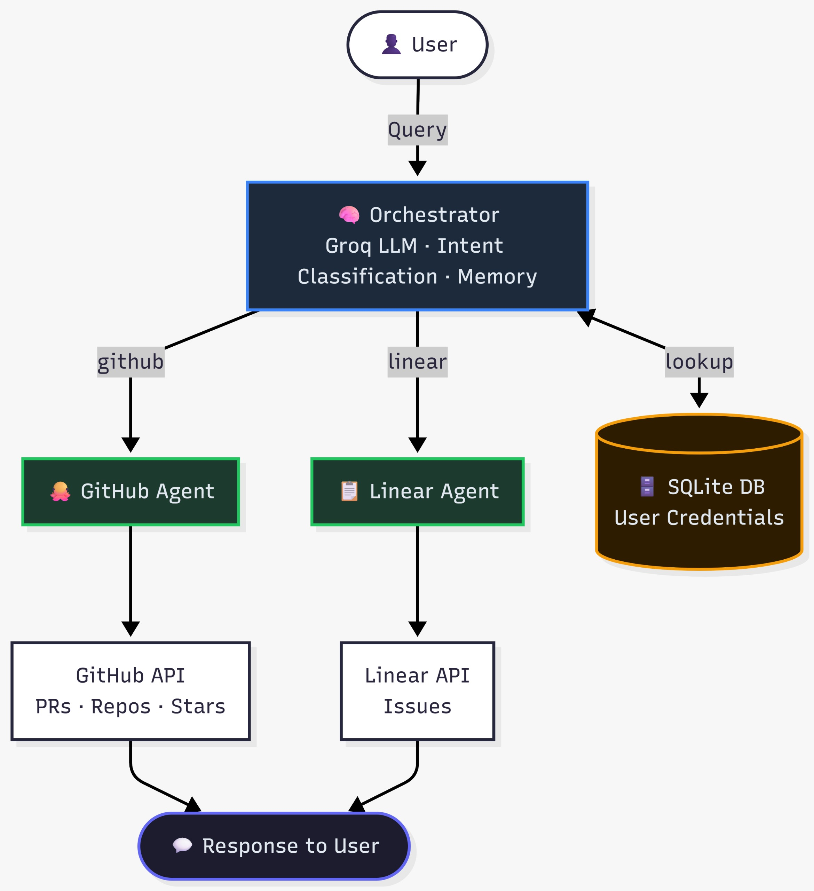

# Multi-agent orchestration system

A multi-agent orchestration system that acts as a smart router. It takes a user's natural language query, figures out what they're trying to do, and hands the task off to specialized agents for either **GitHub** or **Linear**. 

## How it works under the hood

The system is built around a central **Orchestrator** that handles the decision-making logic. Here is the flow:

1. **Intent Classification:** When a query comes in, it's sent to Groq's `llama-3.1-8b-instant` model using structured JSON output. The LLM determines the intent (e.g., `github`, `linear`, `clarify_user`, or `out_of_scope`).
2. **Deterministic User Matching:** To prevent LLM hallucinations, I added a fast programmatic scan that looks for user names (like "Alice" or "Bob") in the query before fully relying on the LLM's user extraction.
3. **Specialized Agents:** 
   - **GitHub Agent:** Uses PyGithub to fetch repositories, pull requests, and starred repos.
   - **Linear Agent:** Uses Linear's GraphQL API to fetch issues and apply status filters (e.g., "In Progress").
4. **Multi-turn Memory:** If a query is ambiguous, the system asks for clarification and remembers the context. For example, if you say "show me open pull requests", it will ask "For who?". If you reply "Alice", it stitches the context together and fetches Alice's PRs.

### Architecture Flow



## Project Structure


multi-agent orchestrator/
├── agents/
│   ├── github_agent.py   # GitHub API integration (PyGithub)
│   └── linear_agent.py   # Linear API integration (GraphQL)
├── utils/
│   ├── config.py         # Environment configuration
│   └── database.py       # SQLite database operations
├── orchestrator.py       # Core routing, memory, and LLM classification
├── main.py               # Main CLI entrypoint
├── test.py               # Automated test scenarios
├── Dockerfile            # App containerization
└── requirements.txt      # Python dependencies


### Quick Start

### 1. Prerequisites
You will need:
- A free **Groq** API key
- **GitHub** Personal Access Tokens (for 2 users)
- **Linear** API Keys (for 2 users)

### 2. Setup
First, duplicate the environment template to create your own configuration file. The '.env.example' file contains the required skeleton structure without any real tokens.

```bash
# Copy the template to create your actual .env file
cp .env.example .env
```

Open the newly created '.env' file in your editor and fill in your actual API keys and tokens. The system will securely read from this file on its very first run.

### 3. Run the App

**Option A: Docker (Recommended)**
```bash
docker build -t multi-agent-orchestrator .
docker run -it --rm --env-file .env multi-agent-orchestrator
```

**Option B: Local Python Environment (Python 3.10+)**
```bash
python -m venv venv
source venv/bin/activate  # On Windows: venv\Scripts\activate
pip install -r requirements.txt
python main.py
```

## Example Interactions

You can test the system by running `python test.py`, which simulates the following scenarios:

- **Direct Routing:** "Show me Alice's open pull requests" routes directly to the GitHub Agent for User 1.

- **Clarification:** "What issues are high priority?" realizes the user is missing and prompts: "Which user's data would you like to access?"

- **Follow-up:** Replying "Bob" triggers the memory module to resolve the previous query for Bob's Linear account.

- **Out of Scope:** "What's the weather today?" safely returns "I cannot answer this question".

## User Management (CLI)

### Add New User
You can dynamically add new users at runtime without editing the `.env` file:
```
add user
```
The CLI will prompt you for the user's name, GitHub token, and Linear API key, then save them directly to the database.

### List Users
To view all registered users and their linked accounts:
```
list users
```
This lists every user in the database along with their configured GitHub and Linear credentials.

---

## Key Design Choices & Assumptions

- **Groq over LangChain/CrewAI:** I intentionally avoided heavy agent frameworks. A direct structured LLM call is faster, much easier to debug, and keeps the latency sub-second.

- **Automatic Database Initialization:** The first time you run the application, it automatically reads your populated '.env' file and uses those credentials to initialize a local SQLite database (`stackgen.db`). This seeded database then acts as the single source of truth for user credentials going forward. This means you can add new users dynamically at runtime using the CLI's `add user` command without ever touching the '.env' file or source code again!

- **Scope Boundaries:** Since both GitHub and Linear have "issues", queries specifically mentioning "issues" or "priority" default to Linear, while "pull requests", "repos", and "stars" route to GitHub.
